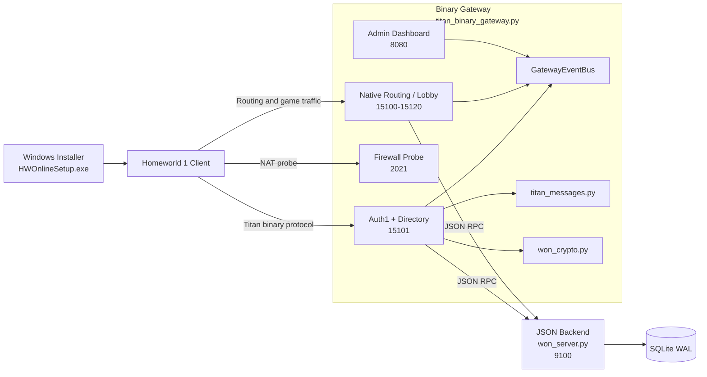
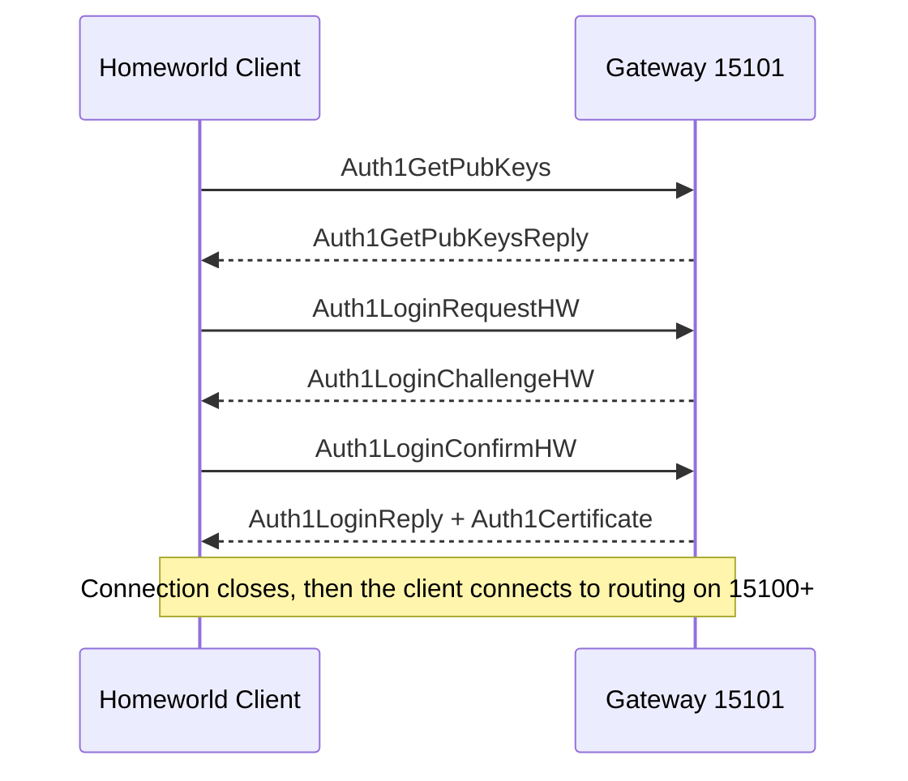

# WON OSS Server (Homeworld-oriented)

Open-source replacement for the Sierra WON (World Opponent Network) backend services, targeting Homeworld 1 multiplayer. It implements the real WON/Titan wire protocol, including Auth1 key exchange, NR-MD5 signatures, and ElGamal encryption, so the original Homeworld 1 client can connect without executable patching.

Tested against the original Homeworld 1.05 patch. Homeworld Remastered Classic is not supported, because its multiplayer functionality was removed and it does not behave like the original retail multiplayer client.

## Architecture




## Features

### Implemented

- **Real Auth1 crypto** (`won_crypto.py`): NR-MD5 signatures, ElGamal public-key encryption, DER key encoding, Auth1PublicKeyBlock builders, and Auth1Certificate builders confirmed against WON open-source behavior.
- **Auth1 handshake** (port `15101`): Full 4-message Homeworld login flow with signed certificates loaded from `keys/`.
- **Auth1Peer sessions**: Encrypted persistent sessions for directory queries and factory requests.
- **Directory service**: `DirGet` SmallMessage support returning AuthServer, TitanRoutingServer, TitanFactoryServer, and `ValidVersions` data objects.
- **Native Homeworld routing** (ports `15100-15120`): `RegisterClient`, `GetClientList`, `SendChat`, `SendData`, `SendDataBroadcast`, `SubscribeDataObject`, `Create/Replace/Delete/RenewDataObject`, `KeepAlive`, and `DisconnectClient`.
- **Silencer routing server** (port `15100`): Legacy Homeworld lobby/conflict protocol support for `INIT`, `NEW_CONFLICT`, `CONFLICTQUERY`, `CHATMESSAGE`, `ABORT_CONFLICT`, and `USER_TERMINATION`.
- **Factory service**: Allocates routing server ports for chat rooms and game rooms on demand.
- **Reconnect-to-match support**: Short reconnect grace window for abrupt disconnects so a returning player can reclaim the same routing slot.
- **Firewall probe** (port `2021`): Returns a 16-byte probe stub used for NAT/firewall detection.
- **Server keepalive and session cleanup**: Routing keepalives and peer session expiry run in the gateway background maintenance loop.
- **Admin dashboard** (port `8080`): Live web UI showing rooms, connected players, chat feed, routing data objects, IP metrics, gateway logs, and a read-only snapshot of `won_server.db`.
- **Backend state**: Auth, lobbies, matchmaking, routing, and game-launch lifecycle via the JSON backend (`won_server.py`).
- **Push-based event delivery**: `GatewayEventBus` pushes chat, join, and game-launch events over persistent TCP.
- **Persistence**: SQLite WAL; users, lobbies, and sessions survive restarts.
- **Docker deployment**: Single-container setup that starts both processes and seeds persistent data on first launch.
- **Windows client installer**: Standalone `.exe` that auto-detects the game, installs a valid CD key, writes `NetTweak.script`, and installs `kver.kp`.

### Known gaps

- **Credential validation**: The server issues a certificate to any connecting client without checking username or password. Since Homeworld is this old, I don't see the point in forcing User reg, will fix if this causes any issues.
- **NAT/firewall detection**: The probe reply is implemented, but strict-NAT behavior still needs broader field testing on real networks.
- **Reconnect-to-match**: Reconnect currently matches on the same player name and IP, so it still needs wider real-world validation in game.
- **Game process model**: Routing rooms are managed in-gateway rather than spawning external `RoutingServHWGame` binaries.

## Roadmap

- **Decode live gameplay packets**: The server already relays native `SendData` and `SendDataBroadcast` traffic during a match, but the payloads are still treated as opaque bytes. The next step is to classify the recurring packet shapes and map them to concrete in-game actions.
- **Use decoded match traffic for diagnostics**: Once packet types are understood, the admin dashboard can expose match timelines, desync clues, launch/start/end markers, and better post-match debugging instead of only packet sizes and counts.
- **Use decoded match traffic for future features**: Decoded traffic would also make it much easier to build match result summaries, lightweight telemetry, and more reliable reconnect or resync experiments without trying to persist every raw frame.

---

## Client install

Build the Windows installer once on a Windows machine:

```powershell
installer\build_installer.bat
```

By default, the installer now targets `homeworld.kerrbell.dev` and offers a custom host/IP option in its server picker UI.

You can still distribute `HWOnlineSetup.exe` to each player and run it as Administrator with an explicit server host or IP:

```powershell
HWOnlineSetup.exe 192.168.x.x
```

If you have DNS set up, you can pass a hostname instead:

```powershell
HWOnlineSetup.exe hw1.example.com
```

The installer:

- auto-detects the Homeworld install directory (registry plus common paths)
- installs a valid WON Homeworld CD key in the registry
- writes `NetTweak.script` so `hosts` file edits are not needed
- installs `kver.kp` into the game folder

No Python is required on client machines. Players just run the installer and then launch Homeworld normally.

### What `NetTweak.script` does

`NetTweak.script` is the client-side file that tells Homeworld which directory and patch server host and port to contact first. The installer writes:

- `DIRSERVER_IPSTRINGS`
- `DIRSERVER_PORTS`
- `PATCHSERVER_IPSTRINGS`
- `PATCHSERVER_PORTS`

In practice, that means:

- `NetTweak.script` tells Homeworld where to connect
- `kver.kp` tells Homeworld which verifier public key to trust

Both have to match the server you are actually running. If the host points at one network and the verifier blob belongs to another, the game can reach the server but Auth1 validation will fail.

### How I found it

I found `NetTweak.script` by reverse-engineering the old Homeworld bootstrap path and then validating the behavior against the live client. The key clues were that changing the `DIRSERVER_*` and `PATCHSERVER_*` values redirected the stock client without any executable patching, and that once those values matched the replacement server, the client successfully connected, queried the directory, completed Auth1, and entered the lobby.

That is why this project does not rely on `hosts` file hacks: the client already has a built-in configuration hook for its initial server lookup, and `NetTweak.script` is that hook.

## Server install

### Python deployment

Run each command in a separate terminal from the repo root.

Install the Python dependencies first:

```powershell
python -m pip install -r requirements-server.txt
```

If you want a fresh trust domain instead of the bundled key set, generate keys once before first start:

```powershell
python generate_keys.py `
  --keys-dir keys
```

This writes:

- `verifier_public.der`
- `verifier_private.der`
- `authserver_public.der`
- `authserver_private.der`
- `kver.kp`

If you are using the bundled trust domain, skip that step and start the backend:

```powershell
python won_server.py `
  --host 127.0.0.1 --port 9100 `
  --db-path won_server.db
```

Then start the binary gateway:

```powershell
python titan_binary_gateway.py `
  --host 0.0.0.0 --port 15101 `
  --backend-host 127.0.0.1 --backend-port 9100 `
  --public-host 192.168.x.x `
  --routing-port 15100 `
  --admin-host 127.0.0.1 --admin-port 8080 `
  --keys-dir keys `
  --log-level INFO
```

Set `--public-host` to the address your clients will use to reach the server. Homeworld connects to port `15101` for Auth1 and directory queries, and to ports `15100+` for routing and lobby traffic.

When running locally, open [http://127.0.0.1:8080/](http://127.0.0.1:8080/) on the host machine to view the admin dashboard.

Ports to expose:

- `15101/tcp` for Titan gateway and Auth1
- `15100-15120/tcp` for routing, chat, and game rooms
- `2021/tcp` for the firewall probe

### Docker deployment

Install Docker Engine and the Docker Compose plugin, then work from the repo root. On Windows, Docker Desktop is the simplest option.

Copy `.env.example` to `.env`:

```powershell
Copy-Item .env.example .env
```

Or on bash:

```bash
cp .env.example .env
```

Edit `.env` and set `PUBLIC_HOST` to the address your clients will use.

If you are reusing an existing network, place your current key files in `data/keys/` before first start so clients continue trusting the server. If you already have a database you want to keep, place it at `data/won_server.db` before first start.

Start the container:

```bash
docker compose up -d --build
```

Watch the logs:

```bash
docker compose logs -f
```

Stop the stack:

```bash
docker compose down
```

Docker notes:

- The container runs both `won_server.py` and `titan_binary_gateway.py`.
- Persistent data is stored under `./data`.
- On first start, the container copies the bundled `won_server.db` and `keys/*` into `./data` only when those files do not already exist.
- The main ports to expose are `15101/tcp`, `15100-15120/tcp`, and `2021/tcp`.
- The admin dashboard is bound to `127.0.0.1:8080` on the Docker host.

---

## Self-hosting with your own keys

This project can be published openly without giving away control of the main network. The source code is public, but trust is defined by the key material in `keys/`.

### What defines a network

These files define a Homeworld network identity:

- `keys/authserver_private.der`
- `keys/authserver_public.der`
- `keys/verifier_private.der`
- `keys/verifier_public.der`
- `keys/kver.kp`

The two private `.der` files are the sensitive part. Do not publish them if you want to remain the operator of your own official network.

### What a self-hosted fork must change

If someone wants to run an independent network instead of joining yours, they should replace the entire `keys/` set with their own matching files before first launch.

Important rules:

- `kver.kp` must match the verifier keypair used by the server
- every client on that fork must receive the matching `kver.kp`
- clients using your public installer or your public `kver.kp` will not automatically trust a different fork
- reusing someone else's private keys means reusing their trust domain, not creating an independent one

### Client bootstrap for a fork

The standalone installer embeds both a default server host and a verifier blob. A fork operator should rebuild the installer after updating:

- `installer/hwclient_setup.cs`

In practice that means:

- set the default host to the fork's own domain or IP
- replace the embedded `kver.kp` bytes with the fork's matching verifier blob
- rebuild `HWOnlineSetup.exe`

If the installer is not rebuilt, the fork operator must at least distribute their own `kver.kp` and a matching `NetTweak.script` manually.

### First-start checklist for an independent fork

1. Replace `keys/` with the fork's own matching verifier and auth files.
2. Use a fresh hostname or IP and a fresh database.
3. If using Docker, place the fork's key files in `./data/keys/` before the first `docker compose up`.
4. Rebuild the Windows installer so it embeds the fork's host and `kver.kp`.
5. Distribute that rebuilt installer, or manually distribute the matching `kver.kp` and `NetTweak.script`.

---

## Auth1 protocol details

The Auth1 handshake uses a 4-message exchange over a single TCP connection on port `15101`.

### Handshake flow



### Key block and certificate

- **Auth1PublicKeyBlock** contains the auth server public key (`p`, `q`, `g`, `y`), signed with the verifier private key. The game verifies this against `kver.kp`.
- **Auth1Certificate** contains an ephemeral user session public key, signed with the auth server private key. It is issued on successful login and carried by the client to authenticate to routing servers.

### TMessage wire format

```text
[u32 LE total_size]      <- includes these 4 bytes
[u32 LE service_type]    <- 201 (Auth1Login)
[u32 LE msg_type]
[body...]
```

Detection: `body[0] == 0xC9` (the low byte of service type 201 in little-endian form).
