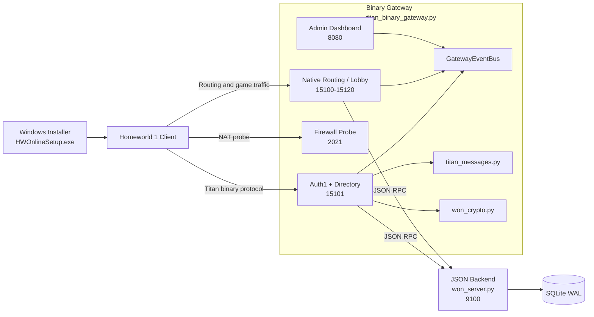

# WON OSS Server (Homeworld-oriented)

[](https://github.com/FlashZ/won_oss_server/actions/workflows/tests.yml)
[](https://www.gnu.org/licenses/agpl-3.0)
[](https://www.python.org/downloads/)
[](https://www.docker.com/)
[](https://en.wikipedia.org/wiki/Homeworld)

Open-source replacement for the Sierra WON (World Opponent Network) backend services, targeting **Homeworld 1 multiplayer**. It implements the real WON/Titan wire protocol — Auth1 key exchange, NR-MD5 signatures, and ElGamal encryption — so the original unpatched Homeworld 1 client can connect directly.

Tested against Homeworld 1.05. Homeworld Remastered Classic is not supported (its multiplayer was removed and it does not behave like the original retail client).

## Quick start (Docker)

```bash
cp .env.example .env        # then edit PUBLIC_HOST to your server's address
docker compose up -d --build
```

This starts both the backend and gateway, seeds default keys and database on first launch, and stores persistent data under `./data`.

Ports to expose:

| Port | Purpose |
|------|---------|
| `15101/tcp` | Auth1 and directory queries |
| `15100-15120/tcp` | Routing, chat, and game rooms |
| `2021/tcp` | Firewall/NAT probe |

The admin dashboard is available at `http://127.0.0.1:8080/` on the host machine.

## Testing

Run the Python test suite locally from the repo root:

```bash
python -m pip install -r requirements-server.txt
python -m pip install pytest
python -m pytest
```

GitHub Actions runs the same suite on every push and pull request across Python 3.10, 3.11, and 3.12.

## Client setup

Distribute `HWOnlineSetup.exe` to players. Run as Administrator

The installer auto-detects the Homeworld install directory, optionally writes a CD key to the registry, updates `NetTweak.script` to point at your server, and installs the `kver.kp` verifier key. No Python required on client machines.

To rebuild the installer from source:

```powershell
installer\build_installer.bat
```

### How client bootstrap works

Two files control which server the game contacts:

- **`NetTweak.script`** — tells Homeworld which directory/patch server to connect to (`DIRSERVER_IPSTRINGS`, `DIRSERVER_PORTS`, `PATCHSERVER_IPSTRINGS`, `PATCHSERVER_PORTS`). The installer updates these values while preserving the rest of the retail script (LAN settings, port tuning).
- **`kver.kp`** — the verifier public key the client uses to validate the server's Auth1 handshake.

Both must match the server you are running. If the host points at one server but the verifier key belongs to another, the client will connect but Auth1 will fail.

## Server setup (Python)

Install dependencies:

```powershell
python -m pip install -r requirements-server.txt
```

Optionally generate fresh keys (skip this to use the bundled key set):

```powershell
python generate_keys.py --keys-dir keys
```

Start the backend and gateway in separate terminals:

```powershell
# Terminal 1 — backend
python won_server.py --host 127.0.0.1 --port 9100 --db-path won_server.db

# Terminal 2 — gateway
python titan_binary_gateway.py `
  --host 0.0.0.0 --port 15101 `
  --backend-host 127.0.0.1 --backend-port 9100 `
  --public-host 192.168.x.x `
  --routing-port 15100 `
  --admin-host 127.0.0.1 --admin-port 8080 `
  --keys-dir keys --log-level INFO
```

Set `--public-host` to the address clients will use to reach the server.

### Docker details

Copy `.env.example` to `.env` and set `PUBLIC_HOST`. To reuse existing data, place key files in `data/keys/` and/or the database at `data/won_server.db` before first start.

```bash
docker compose up -d --build   # start
docker compose logs -f         # watch logs
docker compose down            # stop
```

The container runs both processes and seeds `./data` with defaults on first launch.

## Architecture



The server has two processes:

- **`won_server.py`** — JSON-RPC backend handling auth, lobbies, matchmaking, and game-launch lifecycle. Persists state to SQLite (WAL mode).
- **`titan_binary_gateway.py`** — Binary protocol gateway that speaks the native Titan wire format. Handles Auth1 handshakes, directory queries, routing, the factory service, firewall probes, and the admin dashboard. Communicates with the backend over internal JSON-RPC.

Supporting modules:

- **`won_crypto.py`** — NR-MD5 signatures, ElGamal encryption, DER key encoding, Auth1 key block and certificate builders.
- **`titan_messages.py`** — Titan message schemas and codecs.

### What's implemented

- Full Auth1 handshake with signed certificates
- Encrypted Auth1Peer sessions for directory and factory requests
- Directory service returning auth, routing, factory, and version entries
- Native Homeworld routing: client registration, chat, data relay, data objects, keepalives
- Legacy Silencer lobby/conflict protocol
- Factory service for dynamic game room port allocation
- Reconnect-to-match with a short grace window
- Push-based event delivery via `GatewayEventBus`
- Admin dashboard with live rooms, players, chat, logs, and database snapshot
- SQLite WAL persistence across restarts

### Known limitations

- **No credential validation** — the server issues a certificate to any connecting client without checking credentials. Accounts are auto-created on first login.
- **NAT detection** — the firewall probe reply is implemented but strict-NAT behavior needs broader field testing.
- **Reconnect-to-match** — matches on player name and IP; needs wider real-world validation.
- **In-process routing** — routing rooms are managed in-gateway rather than spawning external `RoutingServHWGame` binaries.

## Roadmap

- **Decode gameplay packets** — the server relays `SendData`/`SendDataBroadcast` traffic as opaque bytes. Next step is classifying packet shapes and mapping them to in-game actions.
- **Match diagnostics** — once packets are decoded, surface match timelines, desync clues, and launch/end markers in the admin dashboard.
- **Match telemetry** — use decoded traffic for result summaries, lightweight stats, and more reliable reconnect/resync.

## Self-hosting with your own keys

The source code is public, but network identity is defined by the key material in `keys/`. The two private `.der` files are the sensitive part — do not publish them if you want to remain the sole operator of your network.

To run an independent network:

1. Generate a fresh key set: `python generate_keys.py --keys-dir keys`
2. Use a fresh hostname/IP and database.
3. If using Docker, place your key files in `./data/keys/` before first `docker compose up`.
4. Rebuild the installer with your host and `kver.kp` embedded (update `installer/hwclient_setup.cs`, then run `build_installer.bat`).
5. Distribute that installer to your players, or manually distribute `kver.kp` and a matching `NetTweak.script`.

Key rules:

- `kver.kp` must match the verifier keypair the server uses
- Every client on your network needs the matching `kver.kp`
- Clients using a different network's installer or `kver.kp` will not trust your server
- Reusing someone else's private keys joins their trust domain rather than creating your own
