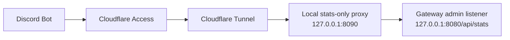

# Stats API Production Access

Simple version:

do not expose the raw admin port to the internet.

If this is going to production, the sensible shape is:

- gateway admin listener stays local-only
- a tiny local proxy exposes only `/api/stats`
- Cloudflare Tunnel points at that proxy
- Cloudflare Access service tokens protect it

That way the bot gets what it needs, but the rest of the admin surface stays private.

## Why this is the right shape

Because otherwise you end up doing the dumb version:

- expose the admin port
- hope nobody pokes the wrong endpoint
- reuse admin auth for bot traffic

No thanks.

This setup means:

- no public inbound admin port
- only `/api/stats` is exposed
- `/api/snapshot` and the dashboard stay private
- the bot uses proper machine auth instead of browser-style login nonsense

## What the app already supports

The server side is already set up for this pretty well:

- the admin HTTP listener can stay on localhost
- there is now a bot-safe `GET /api/stats`
- `STATS_TOKEN` can be separate from `ADMIN_TOKEN`

So this is mostly a deployment/setup decision now, not a giant code problem.

## Recommended production layout

### 1. Keep the gateway local-only

Do this:

- keep the admin/gateway listener on localhost
- do not expose the raw admin port publicly
- do not expose `/api/snapshot`

### 2. Put a tiny local proxy in front

Run a tiny local reverse proxy on something like `127.0.0.1:8090` that:

- forwards only `GET /api/stats` to `http://127.0.0.1:8080/api/stats`
- returns `404` for everything else
- optionally injects `Authorization: Bearer <STATS_TOKEN>` itself

That keeps the bot path narrow and boring, which is what we want.

### 3. Point Cloudflare Tunnel at that proxy

Expose the proxy through `cloudflared` on something like:

- `stats.homeworld.kerrbell.dev`
- `stats.cataclysm.kerrbell.dev`

If both games are on the same VPS, just make sure each hostname maps cleanly to the right local upstream.

### 4. Protect it with Cloudflare Access

Use a self-hosted app in Cloudflare Access with:

- a `Service Auth` policy for the bot
- no anonymous public access

The bot should send:

- `CF-Access-Client-Id`
- `CF-Access-Client-Secret`

## Tailscale note

If `cloudflared` is running on the same VPS as the game server, you do not need Tailscale in the middle for this path. Localhost is simpler.

Tailscale is still good for:

- SSH
- private admin access
- internal machine-to-machine stuff

But for this exact stats flow, same-box localhost is cleaner.

## Authentik note

Use Authentik for people.

Use Cloudflare Access service tokens for the bot.

Trying to push a machine client through browser SSO is just making life harder for no reason.

## Security ranking

Best:

- Cloudflare Tunnel
- Cloudflare Access service token
- local stats-only proxy
- local-only admin listener
- optional `STATS_TOKEN` behind that

Acceptable:

- public reverse proxy with TLS
- only `/api/stats`
- separate `STATS_TOKEN`

Bad idea:

- exposing the raw admin listener
- reusing `ADMIN_TOKEN` for everything
- making `/api/snapshot` public
- putting the full dashboard on the same hostname the bot uses

## What I would actually do

If this was my prod setup, I would do it like this:

1. keep the gateway admin listener on localhost only
2. add a tiny local stats-only proxy
3. put Cloudflare Tunnel in front of that
4. lock it with a Cloudflare Access service-token policy
5. optionally keep `STATS_TOKEN` as a second gate

That gets you the useful part exposed, without exposing the whole admin surface.

## Later

If we ever want to get even cleaner, we can split `/api/stats` onto its own tiny HTTP listener separate from the admin dashboard entirely.

But honestly, the proxy approach is already a pretty solid production setup.
