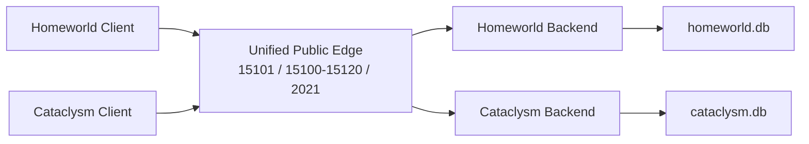

# Shared-IP Dual-Game Architecture

## Summary

Run one public Titan/WON edge on the retail ports and keep Homeworld and
Cataclysm isolated behind it as separate internal backends.

- Public DNS:
  - `homeworld.kerrbell.dev` -> same VPS IP
  - `cataclysm.kerrbell.dev` -> same VPS IP
- Public ports, published once:
  - `15101/tcp`
  - `15100-15120/tcp`
  - `2021/tcp`
- Internal layout:
  - one product-aware edge/gateway
  - one Homeworld backend + DB
  - one Cataclysm backend + DB

This is the recommended design over a fully unified backend/database.

## Current State

The codebase is now partway through this plan.

Completed:

- product profiles exist in one repo
- the gateway has been split into focused modules
- `won_server.py` and `titan_binary_gateway.py` both take `--product`
- the Windows installer can configure Homeworld or Cataclysm from one build
- Docker/default runtime paths are now product-scoped so Homeworld and
  Cataclysm no longer share one flat DB/keys directory by accident
- the gateway now has an experimental `--shared-edge` mode that:
  - classifies Auth1 and directory traffic by product at runtime
  - dispatches backend calls to separate Homeworld and Cataclysm backends
  - keeps peer sessions isolated by product
  - runs both products behind one public `15101`

Not completed yet:

- broad live validation that both retail clients can share one public IP and
  port set at once without player-visible differences
- a production-ready Docker/shared-edge deployment path
- true same-port routing multiplexing; the current shared-edge path keeps
  Homeworld and Cataclysm in separate routing port slices within the retail
  range instead of interleaving both products on the exact same routing port

So the repo is now at the "finish the shared edge" stage, not the "invent the
product split" stage.

## Recommendation

Use **one edge, two backends**.

Do **not** fully merge the current Homeworld and Cataclysm stacks into one
backend yet.

### Why this is the safer option

- Both stock clients want the same public ports, so two separate public stacks
  on one IP are not viable.
- The current code still contains single-product assumptions such as:
  - one advertised `public_host`
  - one routing port view
  - single-product directory paths and version objects
  - backend calls that are not consistently product-scoped
- A naive full merge would risk:
  - Homeworld clients seeing Cataclysm directory entries
  - Cataclysm clients receiving the wrong valid-version data
  - reconnect reservations crossing products
  - routing/chat/game room state bleeding across products

### Why not just keep them fully separate

Keeping them fully separate is simpler in the short term, but it prevents both
games from sharing the same public IP and stock retail ports at the same time.

If simultaneous same-IP support is a goal, a shared public edge is the right
shape.

## Architecture

### Public edge responsibilities

- Listen on the retail public ports once.
- Detect the game from the Titan/WON protocol, not from DNS hostname.
- Pin that product identity to the connection/session/reconnect reservation for
  the lifetime of the flow.
- Forward backend RPC requests only to the matching product backend.
- Keep routing, reconnect, and event state partitioned by product.

### Product detection rules

Choose the product from protocol data in this order:

1. `/TitanServers` service filter:
   - `HomeworldValidVersions` -> Homeworld
   - `CataclysmValidVersions` -> Cataclysm
2. directory root:
   - `/Homeworld` -> Homeworld
   - `/Cataclysm` -> Cataclysm
3. Auth1 `community_name` as fallback
4. existing session or reconnect ownership for resumed routing traffic

### Internal backend responsibilities

Each backend keeps its own:

- users
- sessions
- lobbies
- directory state
- factories
- game server records
- event history

Recommended persistence:

- `data/homeworld/won_server.db`
- `data/cataclysm/won_server.db`

This avoids needing a product column on every table in the first iteration and
greatly reduces the chance of cross-product data bleed.

## Traffic Isolation Rules

For this design to be safe, the edge must treat product as a first-class key
everywhere.

That means the following must all be product-scoped:

- peer sessions
- reconnect reservations
- routing membership
- room and lobby lookup
- event bus delivery
- directory queries and replies
- factory start/register flows
- advertised valid-version objects
- advertised room/game directories

No identifier should be assumed globally unique without a product namespace.
If a client id, session id, lobby id, or username is stored in edge memory, the
product should be part of that key.

## Hostnames And DNS

The DNS names still matter, but mostly for bootstrap and administration:

- `homeworld.kerrbell.dev`
- `cataclysm.kerrbell.dev`

They should both resolve to the same public IP.

The important point is that the TCP listener cannot route by hostname alone,
because the retail client protocols do not give the game-facing Titan listener
an HTTP-style host header or TLS SNI to switch on. The edge must classify by
protocol content.

## Remote Routing / Game Nodes

Yes, remote routing or game nodes can be added later on another VPS in another
region.

### Recommended sequence

Phase 1:

- keep auth, directory, and product classification central on the main VPS
- keep routing and game capacity local while the unified edge is proven

Phase 2:

- add remote product-aware routing/factory nodes in other regions
- allow the central edge/backend to advertise those nodes to clients

### Requirements before remote nodes

- directory replies must advertise per-node host and port, not one global
  `public_host`
- factory registration must carry:
  - product
  - region
  - public host/IP
  - capacity
  - process types
- reconnect reservations must include node identity
- health checks must remove stale remote nodes quickly
- firewall/probe behavior must work correctly on each remote node

## Rollout Plan

0. Completed: refactor the codebase into product profiles in one repo.
1. Completed: make the backend and installer product-aware.
2. Build the unified public edge with explicit product classification.
3. Keep Homeworld and Cataclysm backends isolated behind the edge.
4. Prove simultaneous operation on one public IP with both clients.
5. Only after that, consider remote routing/game nodes.

## Validation

The architecture is only considered correct if all of the following pass:

- Homeworld and Cataclysm can both bootstrap against the same public IP.
- Each product gets only its own valid-version object and directory roots.
- Same username may exist in both games without collision.
- Routing/chat/game-room traffic never crosses products.
- Reconnect after a game or lobby transition resumes only within the same
  product.
- Homeworld firewall behavior still works.
- Cataclysm firewall behavior still works.
- Factory and routing selection remain correct when both games are active at
  once.

## Bottom Line

This is a good idea **if** the target is one public IP serving both games at
the same time.

It is **not** a good idea to fully unify the current forks into one backend and
one shared DB right away. The safer and smarter design is:

- one public edge
- two internal backends
- two DB files
- one codebase with product profiles

That gives the operational benefit of a shared retail front door without taking
on unnecessary cross-product risk too early.
